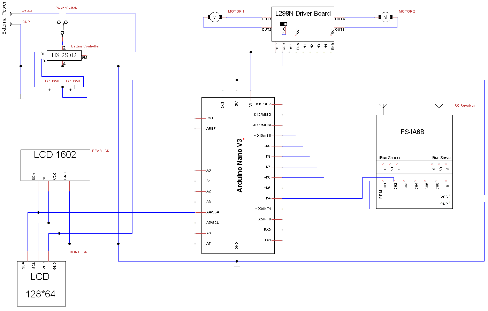

# radioNanoBot
This is the source code and the circuit diagram for the Radio-Controlled Robot built on Arduino Nano

See the details in our blog:
 * https://onerobotstory.blogspot.com/2018/12/14-radio-controlled-robot.html (English)
 * https://refunpro.blogspot.com/2018/08/19.html (Ukrainian)
 
## Hardware

* A chassis made from any scrap you can find
* [Arduino Nano with the expansion shield](https://www.banggood.com/Arduino-Compatible-Nano-V3-Nano-Shield-Expansion-Board-Kit-p-952399.html?p=M908156347868201609Y)
* [DC Motor with encoders 100 RPM 2x](https://www.banggood.com/6V-100210300RPM-Encoder-Motor-DC-Gear-Motor-p-1016183.html?p=M908156347868201609Y)
* [Motor mount bracket 2x](https://www.banggood.com/25mm-Metal-Gear-Motor-Support-Bracket-Motor-Fixed-Mount-p-1171586.html?p=M908156347868201609Y)
* [Wheel coupler 2x](https://www.banggood.com/3mm-4mm-5mm-6mm-7mm-Hexagonal-Copper-Coupling-Coupler-for-Robot-Car-Wheel-p-1171587.html?p=M908156347868201609Y)
* [L298N Motor Controller](https://www.banggood.com/Wholesale-Dual-H-Bridge-DC-Stepper-Motor-Drive-Controller-Board-Module-Arduino-L298N-p-42826.html?p=M908156347868201609Y)
* [Graphic LED Display Mono 128x64, I2C](https://www.banggood.com/1_3-Inch-4Pin-White-OLED-LCD-Display-12864-IIC-I2C-Interface-Module-For-Arduino-p-1067874.html?p=M908156347868201609Y)
* [Text LCD 1602, I2C](https://www.banggood.com/IIC-I2C-1602-Blue-Backlight-LCD-Display-Module-For-Arduino-p-950726.html?p=M908156347868201609Y)
* [FlySky 6-channel RC transmitter + receiver](https://www.banggood.com/FlySky-FS-i6-2_4G-6CH-AFHDS-RC-Transmitter-With-FS-iA6B-Receiver-p-983537.html?p=M908156347868201609Y)
* [18650 cells 2x](https://www.banggood.com/2pcs-INR18650-35E-3_6v-3500mah-Flattop-Rechargeable-18650-Li-ion-Battery-p-1145623.html?p=M908156347868201609Y)
* [2S Battery Controller](https://www.banggood.com/HX-2S-02-3A-Protection-Board-For-2S-7_4V-8_4V-Lipo-Battery-p-1116563.html?p=M908156347868201609Y)
* [T-Plug Connectors](https://www.banggood.com/Ten-Pair-Of-Fireproof-T-Plug-Connector-For-RC-ESC-Battery-p-987711.html?p=M908156347868201609Y)
* [Eachine-WT50 Universal Charger (can be any other)](https://www.banggood.com/Eachine-WT50-6A-50W-ACDC-Balance-Charger-Discharger-For-LiPoNiCdPB-Battery-p-1054492.html?p=M908156347868201609Y)

## Circuit Diagram

[The same diagram in TinyCad format](RadioNanoBot.dsn)

## Software

*radioNanoBot.ino* - the entry point with the standard Arduino setup() and loop() functions

*MotorL298NController.h/.cpp* - a simple class to manage the motors through L298N controller

## Changes List
### 1.0
The initial version with the very basic remote control and LCD displays functionality. More details here:
 * https://onerobotstory.blogspot.com/2018/12/14-radio-controlled-robot.html (English)
 * https://refunpro.blogspot.com/2018/08/19.html (Ukrainian)

# Liked some of my work?

